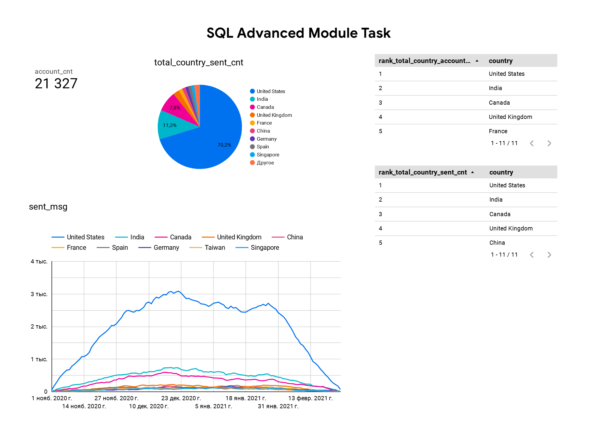

# E-Commerce Account & Email Activity Analysis

## Project Overview

This project analyzes account creation and email sending activity across countries using SQL and Looker Studio.
The dataset was built from multiple BigQuery tables using CTEs, window functions, and aggregations to create a unified reporting dataset with country-level rankings.

The objective was to:

- Aggregate account creation and email metrics by country and date

- Rank countries by total accounts and email volume

- Visualize country-level performance and email sending dynamics over time

## Tools & Technologies

- SQL (BigQuery) — CTEs, window functions (`DENSE_RANK`, `SUM OVER`), `UNION ALL`

- Looker Studio

## Database Structure

The query joins the following tables:

- `account` – account details (send interval, verification, unsubscribe status)

- `account_session` – links accounts to sessions

- `session` – session dates

- `session_params` – session-level attributes (country)

- `email_sent` – email send events

- `email_open` – email open events

- `email_visit` – email click events

## Data Preparation (SQL Layer)

[View SQL Query](sql/sql.sql)

The reporting dataset was created through a multi-step SQL pipeline:

- **account_dataset CTE** — aggregates account creation metrics by date, country, and account attributes

- **email_dataset CTE** — aggregates email send, open, and click events with the same dimensions

- **union_dataset CTE** — merges both datasets via `UNION ALL`

- **union_final CTE** — performs final aggregation

- **Final query** — calculates country totals using `SUM() OVER(PARTITION BY country)` and ranks countries using `DENSE_RANK()`, filtered to top 10 by accounts or sent emails

## Dashboard



🔗 [Interactive dashboard on Looker Studio](https://lookerstudio.google.com/s/iWIdmRQYbCE)

The Looker Studio dashboard includes:

- Total account count KPI (21,327)

- Sent email distribution by country (pie chart)

- Sent email dynamics over time by country (line chart)

- Country ranking by total accounts

- Country ranking by total sent emails

## Key Insights

- **United States** dominates email activity with **70.2%** of all sent emails

- **India** (11.3%) and **Canada** (7.8%) follow as the second and third largest markets

- Top 5 countries by accounts: United States, India, Canada, United Kingdom, France

- Top 5 countries by sent emails: United States, India, Canada, United Kingdom, China

- Email sending peaked in **late November – early December 2020** and declined steadily through January 2021, reaching near-zero by mid-February

- Country rankings by accounts and sent emails are largely aligned, with minor differences (France vs China at position 5)

## How to Run

1. Clone this repository

2. Open [`sql/sql.sql`](sql/sql.sql) to review the BigQuery query

3. Explore the [interactive dashboard on Looker Studio](https://lookerstudio.google.com/s/iWIdmRQYbCE) or view the screenshot in [`images/`](images/)

## Project Structure

```
e-commerce-account-email-analysis/
├── sql/
│   └── sql.sql
├── images/
│   └── dashboard_preview.png
└── README.md
```
